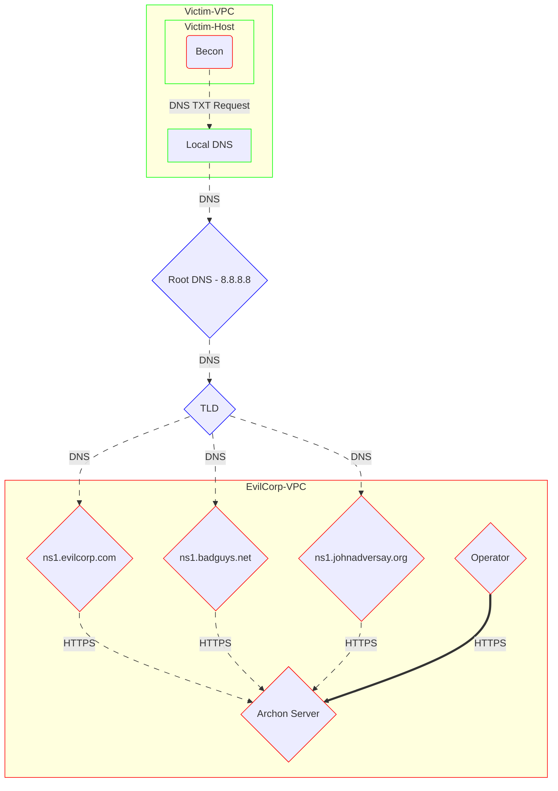

# 🕵️ Unkn0wnC2

DNS-based Command & Control framework utilizing multiple authoritative DNS servers and encrypted C2 communications for Red Team adversary emulation. This DNS C2 implementation's strength comes from its malleable timing model and mesh architecture.

This framework was created to address two specific gaps in traditional DNS C2 projects and specifically test ingress/egress within highly restrictive environments.

1. Exfiltration of command output can be noisy.  
   DNS exfiltration often requires many packets for large outputs, which can trigger alerts. Many C2s let you adjust beacon timing, but they send exfiltrated data all at once. Depending on the volume, that burst of DNS traffic can set off detections.

   > Unkn0wnC2 lets you control not only beacon timing but also the timing of data exfiltration. When a beacon runs a command, its output is returned according to the configured timings, which spreads DNS traffic out over longer periods.

2. Beacons are usually limited to a single domain.  
   Most C2 frameworks restrict beacons to a single domain or IP. Allowing beacons to use multiple domains can improve throughput and make traffic patterns more flexible.

   > Unkn0wnC2 supports single- or multi-domain beacons. New domains can be added to an active beacon as new DNS servers are brought online, so existing beacons can begin using additional domains without restarting.

With those two gaps addressed, the goal of Unkn0wnC2 is to enable adversary emulation in highly restrictive environments — for example, cloud VPCs that allow only DNS to the Internet. Like many DNS-based C2 frameworks, Unkn0wnC2 relies on standard DNS resolution behavior: beacons resolve through the target's configured DNS infrastructure rather than querying Unkn0wnC2 servers directly.

> Further details on how Unkn0wnC2 works can be found below at [🏗️ Protocol Architecture](#🏗️-Protocol-Architecture)

Future Features:
* Exfil only client
* Add functionality to unkn0wnc2 binary to build components from commandline without standing up webui. 
* Improved Client with syscalls for information gathering instead of command execution.
* Exfil command for exfiltrating files instead of using cat.
* BoF execution
* In memory execution
* CNAME DNS Communication instead of TXT and possiblt use other DNS fields for comms.
* All the bug fixes.
* Dockerize


> [!CAUTION]
> FOR AUTHORIZED SECURITY TESTING ONLY
> This software is provided for educational and authorized security testing purposes only. Users must:
> - Obtain explicit written authorization before deployment
> - Comply with all applicable local, state, and federal laws
> - Use only in controlled environments with proper authorization
> - Understand that unauthorized access to computer systems is illegal
> The author is not responsible for misuse or illegal activity. Use at your own risk.

## 🚀 Quick Deployment

1. Setup Glue Records for DNS-Servers

Each domain used will need NS1 and NS2 records setup. These records will point toward the IP of each DNS-Server.

2. **Clone this repo**
```bash
git clone https://github.com/abb3rrant/Unkn0wnC2
cd Unkn0wnC2
```

3. **Run the build script**
```bash
sudo chmod +x build.sh
sudo ./build.sh
```
> This will:
> - Compile and install the Archon server to `/usr/bin/unkn0wnc2`
> - Auto-generate secure credentials (displayed once)
> - Create TLS certificates for the Archon server
> - Install all dependencies for building and Archon WebUI to `/opt/unkn0wnc2/`
> - Create service file for the Archon server at /etc/systemd/system/unkn0wnc2.service

4. **Save the admin password in the build scripts output, this will be used to access the WebUI.**

5. **Start the Archon Server**

* Service
```bash
# Edit service file as needed for bind-addr and bind-port
sudo systemctl enable --now unkn0wnc2
```

* Manual
```bash
sudo unkn0wnc2 --bind-addr <interface IP to bind to> --bind-port <port>
```

6. **Access web UI: `https://<server-ip>:<port>/`**  


7. **Change admin password and create operators**


8. **Build components (DNS servers, clients, stagers) through the web interface.**


9. Deploy DNS-Servers, ensure port 53 is unbound, you may need to stop the systemd-resolved service. To run the DNS-Servers, simply run the binary as sudo or create/start a service for it.
```bash
sudo ./dns-server
```

---

## 🏗️ Protocol Architecture

### Shadow Mesh

A huge feature of Unkn0wnC2 is Shadow Mesh. Unkn0wnC2 can be used with 1 domain or multiple. This helps spread out DNS traffic to multiple domains in an attempt to allow for more throughput, avoid alerts, and dynamically add/remove domains. If a domain is *burned*, you can stand up a new DNS-server under a new domain and existing beacons will automicatically be updated with the new domain. Currently, the amount of domains supported is as many as you can fit within the TXT field in a DNS TXT Request. Since domain names vary, a specific number of supported domains has not been tested. Future updates may include a "chunked" domain delivery to allow for many domains.



### Authoritative DNS

Unkn0wnC2 relies on typical DNS resolutions for domains, this means that when any request for one of your subdomain's is made, it does not go directly to you DNS servers. The request is first routed through the victems local DNS resolver and then pushed to root DNS, like Google. Google will push this question to the TLD of your domain such as .com or .net and then to your DNS server configured at your NS records. This server will act as the authoirty for the configured domain, meaning any subdomain is handled by you. If any subdomain is requested and it is not C2 traffic, the DNS-servers are configured to respond with a set of random IPs. If the DNS-server is used to resolve DNS requests, then the DNS-server will forward the request to 8.8.8.8 and respond with 8.8.8.8's answer. This keeps the DNS-server acting as if it were a real DNS-server.


## Encryption & Encoding Pipeline

> [!NOTE]
> Beacon communications utilizes AES-GCM Encryption and then encodes the encrypted data with Base36 encoding. Base36 is a non-standard encoding protocol that is comprised of the lowercase English alphabet (a-z), and numbers (0-9).


#### Outbound (Plaintext → DNS Query)

```
┌──────────────┐    ┌──────────────┐    ┌──────────────┐    ┌──────────────┐
│  Plaintext   │───>│  AES-256-GCM │───>│Base36 Encode │───>│ DNS Labels   │
│   Message    │    │  Encryption  │    │  (DNS-safe)  │    │ (62 char max)│
└──────────────┘    └──────────────┘    └──────────────┘    └──────────────┘
     |                     |                    |                    |
  "CHK|abc"          [encrypted bytes]     "3g7k2m..."      "3g7k2m.abc.com"
```

#### Inbound (DNS Response → Plaintext)

```
┌──────────────┐    ┌──────────────┐    ┌──────────────┐    ┌──────────────┐
│  DNS TXT     │───>│Base36 Decode │───>│  AES-256-GCM │───>│  Plaintext   │
│   Record     │    │              │    │  Decryption  │    │   Response   │
└──────────────┘    └──────────────┘    └──────────────┘    └──────────────┘
     |                     |                    |                    |
 "TXT: 3g7k..."        [encoded bytes]    [encrypted bytes]      "ACK"
```

### 🔐 Communication Pipeline

```mermaid
sequenceDiagram
    participant Beacon
    participant DNS_Resolver
    participant DNS_Server
    participant Master
    
    Note over Beacon: Generate check-in message
    Beacon->>Beacon: CHK|beaconID|hostname|username|os|arch
    Beacon->>Beacon: Encrypt with AES-GCM
    Beacon->>Beacon: Encode with Base36
    Beacon->>Beacon: Add timestamp for cache busting
    Beacon->>Beacon: Split into 62-char DNS labels
    
    Note over Beacon: Select domain (Shadow Mesh)
    Beacon->>Beacon: selectDomain() - never reuse last domain
    
    Beacon->>DNS_Resolver: TXT query: <base36>.<timestamp>.domain
    DNS_Resolver->>DNS_Server: Forward TXT query
    
    Note over DNS_Server: Process beacon query
    DNS_Server->>DNS_Server: Extract subdomain
    DNS_Server->>DNS_Server: Remove timestamp
    DNS_Server->>DNS_Server: Base36 decode
    DNS_Server->>DNS_Server: AES-GCM decrypt
    DNS_Server->>DNS_Server: Parse CHK message
    
    alt First Check-In (New Beacon)
        DNS_Server->>DNS_Server: Register new beacon locally
        DNS_Server->>Master: POST /api/dns-server/beacon<br/>{beacon_id, hostname, username, os, arch, ip}
        Master->>Master: Store beacon in database
        Master->>Master: Log audit event
        Master-->>DNS_Server: 200 OK {success: true}
        
        DNS_Server->>Master: GET /api/dns-server/beacons?dns_server_id=X
        Master-->>DNS_Server: Return all known domains
        
        DNS_Server->>DNS_Server: Format DOMAINS response
        DNS_Server->>DNS_Server: DOMAINS|domain1,domain2,domain3
        DNS_Server->>DNS_Server: Encrypt + Base36 encode
        DNS_Server-->>DNS_Resolver: TXT record with domain list
        
    else Existing Beacon - Poll for Task
        DNS_Server->>DNS_Server: Update beacon.LastSeen
        DNS_Server->>DNS_Server: Check local task queue
        
        alt No tasks locally, poll Master
            DNS_Server->>Master: GET /api/dns-server/tasks?dns_server_id=X
            Master->>Master: Query pending tasks for this DNS server
            Master-->>DNS_Server: Return task list [{task_id, beacon_id, command}]
            
            alt Tasks available from Master
                DNS_Server->>DNS_Server: Add tasks to local queue
                DNS_Server->>DNS_Server: Format TASK response
                DNS_Server->>DNS_Server: TASK|taskID|command
                DNS_Server->>DNS_Server: Encrypt + Base36 encode
                
                DNS_Server->>Master: POST /api/dns-server/tasks/delivered<br/>{task_id, beacon_id}
                Master->>Master: Update task status: pending → sent
                Master-->>DNS_Server: 200 OK
                
                DNS_Server-->>DNS_Resolver: TXT record with task
            else No tasks from Master
                DNS_Server->>DNS_Server: Format ACK response
                DNS_Server->>DNS_Server: Encrypt + Base36 encode
                DNS_Server-->>DNS_Resolver: TXT record: "ACK"
            end
        else Task in local queue
            DNS_Server->>DNS_Server: Format TASK response
            DNS_Server->>DNS_Server: TASK|taskID|command
            DNS_Server->>DNS_Server: Encrypt + Base36 encode
            
            DNS_Server->>Master: POST /api/dns-server/tasks/delivered<br/>{task_id, beacon_id}
            Master->>Master: Update task status: pending → sent
            Master-->>DNS_Server: 200 OK
            
            DNS_Server-->>DNS_Resolver: TXT record with task
        end
    end
    
    DNS_Resolver-->>Beacon: TXT response
    Beacon->>Beacon: Base36 decode
    Beacon->>Beacon: AES-GCM decrypt
    Beacon->>Beacon: Process response (ACK/TASK/DOMAINS)
```


### 📨 Message Format

### Beacon → DNS Server Messages

| Message Type | Format | Description | Example |
|--------------|--------|-------------|---------|
| **CHECKIN/CHK** | `CHK\|beaconID\|hostname\|username\|os\|arch` | Beacon check-in to register and poll for tasks | `CHK\|abc123\|WORKSTATION1\|jsmith\|windows\|amd64` |
| **RESULT** | `RESULT\|beaconID\|taskID\|<result_data>` | Submit complete task result (small results) | `RESULT\|abc123\|task1001\|Command output here` |
| **RESULT_META** | `RESULT_META\|beaconID\|taskID\|totalSize\|totalChunks` | Announce incoming chunked result (phase 1) | `RESULT_META\|abc123\|task1001\|524288\|10` |
| **DATA** | `DATA\|beaconID\|taskID\|chunkIndex\|<chunk_data>` | Submit result chunk (phase 2) | `DATA\|abc123\|task1001\|0\|<base64_chunk>` |
| RESULT_COMPLETE| `RESULT_COMPLETE\|beaconID\|taskID\|totalChunks` | Declare task exfiltration complete (phase 3) | `RESULT_COMPLETE\|abc123\|task1001\|10` |
### Stager → DNS Server Messages

| Message Type | Format | Description | Example |
|--------------|--------|-------------|---------|
| **STG** | `STG\|clientIP\|os\|arch` | Initial stager request to start session | `STG\|192.168.1.100\|windows\|amd64` |
| **CHUNK** | `CHUNK\|chunkIndex\|clientIP\|sessionID` | Request specific beacon chunk | `CHUNK\|0\|192.168.1.100\|sess_abc123` |
| **ACK** | `ACK\|chunkIndex\|clientIP\|sessionID` | (DEPRECATED) Old stager acknowledgment | `ACK\|5\|192.168.1.100\|sess_abc123` |

### DNS Server → Beacon/Stager Responses

| Response Type | Format | Description | Example |
|---------------|--------|-------------|---------|
| **Task Delivery** | `TASK\|taskID\|command` | Deliver task to beacon | `TASK\|task1001\|whoami` |
| **ACK** | `ACK` | Acknowledge message receipt | `ACK` |
| **Chunk Data** | `<base36_encoded_chunk>` | Binary chunk for stager | `3g7k2m...` |
| **Session Info** | `sessionID\|totalChunks` | Response to STG request | `sess_abc123\|15` |
| **ERROR** | `ERROR` | Invalid or malformed message | `ERROR` |

### Malleable Timing (stager / client / exfil)

This project exposes several timing parameters that are intentionally malleable to tune stealth vs throughput. These are adjusted through the Builder page within the Archon server's WebUI.

Key parameters and defaults (units):

- Stager
  - jitter_min_ms = 1000 (1.0 s)
  - jitter_max_ms = 2000 (2.0 s)
  - chunks_per_burst = 5
  - burst_pause_ms = 12000 (12 s)
  - retry_delay_seconds = 3
  - max_retries = 5

- Client check-in
  - sleep_min = 60 (60 s)
  - sleep_max = 120 (120 s)

- Client exfil
  - exfil_jitter_min_ms = 10000 (10 s)
  - exfil_jitter_max_ms = 30000 (30 s)
  - exfil_chunks_per_burst = 5
  - exfil_burst_pause_ms = 120000 (120 s)

How the pieces interact (approximate calculations):
- Number of bursts for N chunks: bursts = ceil(N / chunks_per_burst)
- Average jitter (ms) = (jitter_min_ms + jitter_max_ms) / 2
- Stager total time ≈ N * RTT_seconds_per_chunk + bursts * ((avg_jitter_ms + burst_pause_ms) / 1000)
  - Example (stager defaults, 100 chunks): avg_jitter = 1.5 s, burst pause = 12 s → per-burst pause ≈ 13.5 s
    - bursts = 20 → pause_time ≈ 270 s
    - transfer_time ≈ 100 s → total ≈ 370 s (~6 min 10 s)

- Exfil (client) will be significantly slower with larger jitter/pause values:
  - Example (exfil defaults, 100 chunks): avg_jitter = 20 s, burst pause = 120 s → per-burst pause ≈ 140 s
    - bursts = 20 → pause_time ≈ 2800 s (~46 min 40 s)
    - transfer_time ≈ 100 s → total ≈ 2900 s (~48 min 20 s)

---

**Version:** 0.3.0  
**License:** Use for authorized security testing only  

---


