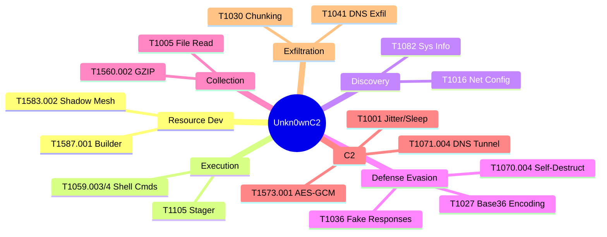

# 🛡️ Unkn0wnC2 Operational TTP Brief

## 📋 Executive Summary
Unkn0wnC2 is a specialized DNS Command & Control framework designed for high-security environments. It emphasizes **covert communication**, **resilience**, and **malleable traffic patterns** to evade detection. This brief outlines the specific Tactics, Techniques, and Procedures (TTPs) mapped to the MITRE ATT&CK framework, based on the current codebase implementation.

## 🗺️ MITRE ATT&CK Matrix

| Tactic | ID | Technique | Procedure (Unkn0wnC2 Implementation) |
| :--- | :--- | :--- | :--- |
| **Resource Development** | **T1587.001** | Develop Capabilities: Malware | **WebUI Builder**: Generates custom Go agents (Beacon) and Rust binaries (Exfil Client). **Cross-Compilation**: Supports Windows/Linux/ARM targets. |
| | **T1583.002** | Acquire Infrastructure: Domains | **Shadow Mesh**: Rotates through multiple authoritative domains for resilience. |
| | **T1583.006** | Acquire Infrastructure: DNS Server | **Authoritative DNS**: Custom nameservers handle C2 traffic directly. |
| **Execution** | **T1059.003** | Command and Scripting Interpreter: Windows Command Shell | **Shell Execution**: Windows Beacons execute commands via `cmd.exe /c`. |
| | **T1059.004** | Command and Scripting Interpreter: Unix Shell | **Shell Execution**: Linux Beacons execute commands via `/bin/sh -c` or `/bin/ash`. |
| | **T1105** | Ingress Tool Transfer | **Staged Loading**: C-based Stager downloads full beacon binaries in chunks over DNS using a custom `STG` -> `META` -> `CHUNK` protocol. |
| **Discovery** | **T1082** | System Information Discovery | **Host Survey**: Beacon collects Hostname, OS, and Architecture on startup. |
| | **T1033** | System Owner/User Discovery | **User Survey**: Beacon collects current Username on startup. |
| | **T1016** | System Network Configuration Discovery | **DNS Discovery**: Stager parses `/etc/resolv.conf` (Linux) to identify system DNS servers. |
| **Defense Evasion** | **T1027** | Obfuscated Files or Information | **Payload Obfuscation**: Stager uses Base36 encoding (no encryption). Beacon uses AES-GCM + Base36 encoding. |
| | **T1140** | Deobfuscate/Decode Files or Information | **In-Memory Decoding**: Stager decodes Base36/Base64 payloads in memory before execution. |
| | **T1070.004** | Indicator Removal: File Deletion | **Self-Destruct**: Beacon `selfdestruct` command triggers self-deletion via `cmd` or `rm`. |
| | **T1036** | Masquerading | **Fake DNS Responses**: Server forwards non-C2 queries to Google DNS (8.8.8.8) or returns random IPs to mimic legitimate nameservers. |
| **Collection** | **T1560.002** | Archive Collected Data: Archive via Library | **Compression**: Beacon GZIPs command output before exfiltration. |
| | **T1005** | Data from Local System | **File Reading**: Exfil Client reads local files for transmission. |
| **Command and Control** | **T1071.004** | Application Layer Protocol: DNS | **DNS Tunneling**: Encapsulates C2 commands/results in DNS TXT queries (Beacon) or Label/EDNS0 (Exfil Client). |
| | **T1573.001** | Encrypted Channel | **AES-GCM**: End-to-end encryption for Beacon C2 traffic. (Note: Stager is unencrypted Base36). |
| | **T1001** | Data Obfuscation | **Malleable Timing**: Jitter, sleep intervals, and burst/pause configurations to evade traffic analysis. |
| **Exfiltration** | **T1041** | Exfiltration Over C2 Channel | **DNS Exfil**: Data is exfiltrated via encrypted subdomains (Exfil Client) or TXT records (Beacon). |
| | **T1030** | Data Transfer Size Limits | **Chunking**: Large files are split into small, DNS-safe chunks. Beacon uses a 3-phase `RESULT_META` -> `DATA` -> `RESULT_COMPLETE` protocol. |

## 🕸️ TTP Visualization

## 🔄 Operational Flow

1.  **Resource Development**: Operator uses the **WebUI Builder (T1587.001)** to compile a C-stager, Go-beacon, or Rust-exfil client. **Shadow Mesh (T1583.002)** domains are configured.
2.  **Initial Access**: *(Not covered by Unkn0wnC2 - assumed via other means)*.
3.  **Execution**: Stager runs on target. It performs **DNS Discovery (T1016)** and uses **DNS Tunneling (T1071.004)** to request the full beacon.
    *   *Note: Stager traffic is Base36 encoded but **not** encrypted.*
4.  **Ingress**: The beacon is downloaded in chunks (**T1105**), **Decoded (T1140)**, and executed.
5.  **Discovery**: Beacon performs **System (T1082)** and **User (T1033)** discovery on startup.
6.  **C2**: Beacon checks in using **AES-GCM (T1573.001)** encrypted **Base36 (T1027)** messages over DNS. It sleeps with **Jitter (T1001)** to avoid detection.
    *   *Note: Server forwards legitimate DNS traffic to 8.8.8.8 (**T1036**).*
7.  **Action**: Operator issues shell commands (**T1059.003/4**).
8.  **Collection & Exfiltration**:
    *   **Beacon**: Output is **Compressed (T1560.002)**, **Chunked (T1030)**, and exfiltrated over the DNS channel (**T1041**) using TXT records.
    *   **Exfil Client**: Reads local files (**T1005**) and exfiltrates via encrypted subdomain labels or EDNS0 options.
9.  **Cleanup**: Operator issues `selfdestruct` to trigger **File Deletion (T1070.004)**.
