# DNS Workflow Diagrams - Detailed Scenarios

**Date:** November 6, 2025  
**Purpose:** Comprehensive visual diagrams for all DNS communication patterns

---

## 1. Complete Beacon Lifecycle


---

## 2. DNS Query Path - Network Level


---

## 3. Shadow Mesh in Action - Query Distribution

```mermaid
sequenceDiagram
    participant Beacon
    participant secwolf.net
    participant errantshield.com
    participant cryptshield.org
    participant Master
    
    Note over Beacon: Check-in #1
    Beacon->>Beacon: selectDomain() → secwolf.net
    Beacon->>secwolf.net: CHK query
    secwolf.net-->>Beacon: TASK response
    
    Note over Beacon: Execute task, result = 200 bytes (4 chunks)
    Beacon->>Beacon: Send RESULT_META
    Beacon->>Beacon: selectDomain() → errantshield.com<br/>(excludes last: secwolf.net)
    Beacon->>errantshield.com: RESULT_META
    errantshield.com-->>Beacon: ACK
    
    Note over Beacon: Chunk 1
    Beacon->>Beacon: selectDomain() → cryptshield.org<br/>(excludes last: errantshield.com)
    Beacon->>cryptshield.org: DATA|chunk1
    cryptshield.org->>Master: Forward chunk1
    cryptshield.org-->>Beacon: ACK
    
    Note over Beacon: Chunk 2
    Beacon->>Beacon: selectDomain() → secwolf.net<br/>(excludes last: cryptshield.org)
    Beacon->>secwolf.net: DATA|chunk2
    secwolf.net->>Master: Forward chunk2
    secwolf.net-->>Beacon: ACK
    
    Note over Beacon: Chunk 3
    Beacon->>Beacon: selectDomain() → errantshield.com<br/>(excludes last: secwolf.net)
    Beacon->>errantshield.com: DATA|chunk3
    errantshield.com->>Master: Forward chunk3
    errantshield.com-->>Beacon: ACK
    
    Note over Beacon: Chunk 4
    Beacon->>Beacon: selectDomain() → cryptshield.org<br/>(excludes last: errantshield.com)
    Beacon->>cryptshield.org: DATA|chunk4
    cryptshield.org->>Master: Forward chunk4
    cryptshield.org-->>Beacon: ACK
    
    Note over Master: Reassemble from 3 different sources
    Master->>Master: Collect: chunk1(DNS3) + chunk2(DNS1)<br/>+ chunk3(DNS2) + chunk4(DNS3)
    Master->>Master: Task status: completed
    
    rect rgb(200, 255, 200)
        Note over secwolf.net,cryptshield.org: All DNS servers notified<br/>beacon.CurrentTask cleared
        Master->>secwolf.net: Task completed
        Master->>errantshield.com: Task completed
        Master->>cryptshield.org: Task completed
    end
```



---

## 4. Encryption/Encoding Pipeline - Detailed

```mermaid
flowchart TD
    subgraph "Beacon: Prepare Message"
        A1[Command: CHK|abc1|host|user|linux] --> A2[Add Timestamp]
        A2 --> A3[CHK|abc1|host|user|linux|1730937600]
    end
    
    subgraph "AES-GCM Encryption"
        A3 --> B1[Generate Random Nonce: 12 bytes]
        B1 --> B2[AES-GCM-256 Seal]
        B2 --> B3[nonce||ciphertext||tag]
        B3 --> B4[Total: 12 + len + 16 bytes]
    end
    
    subgraph "Base36 Encoding"
        B4 --> C1[Bytes to BigInt]
        C1 --> C2[BigInt.Text36]
        C2 --> C3[Lowercase string: 0-9a-z only]
    end
    
    subgraph "DNS Label Splitting"
        C3 --> D1[Total length check]
        D1 --> D2{Length > 62?}
        D2 -->|Yes| D3[Split: chars0-61]
        D2 -->|No| D5[Single label]
        D3 --> D4[Remaining chars]
        D4 --> D2
        D5 --> D6[labels array]
        D3 --> D6
    end
    
    subgraph "DNS Query Construction"
        D6 --> E1[Join labels with dots]
        E1 --> E2[Append timestamp]
        E2 --> E3[Append domain]
        E3 --> E4[Final FQDN]
        E4 --> E5[TXT query packet]
    end
    
    E5 --> F[Send to DNS]
    
    style B2 fill:#f9f,stroke:#333,stroke-width:3px
    style C2 fill:#bbf,stroke:#333,stroke-width:3px
    style E4 fill:#9f9,stroke:#333,stroke-width:3px
```

**Example with Real Data:**
```
Input:     "CHK|abc1|hostname|username|linux"
           ↓ Add timestamp
Timestamped: "CHK|abc1|hostname|username|linux|1730937600"
           ↓ AES-GCM encrypt (with random nonce)
Encrypted: [12-byte nonce][ciphertext][16-byte tag]
           = 0x3f8a9b2c1d5e... (52 bytes)
           ↓ Base36 encode
Base36:    "8xk2m9p4qr7n3l5k8w9t2v6h4j3g7f5d9s8a1k0m..."
           (length ~84 chars)
           ↓ Split into 62-char labels
Labels:    ["8xk2m9p4qr7n3l5k8w9t2v6h4j3g7f5d9s8a1k0m...(62)",
            "2b4x9k7l3m5n8p..."]
           ↓ Join and add domain
Query:     "8xk2m9p4qr...k0m.2b4x9k7l...p.1730937600.secwolf.net"
           ↓ DNS TXT query
```

---

## 5. Server-Side Processing Flow


---

## 6. Chunk Reassembly at Master


---

## 7. Error Scenarios and Recovery

### 7.1 Chunk Lost During Transmission

```mermaid
sequenceDiagram
    participant Beacon
    participant DNS1
    participant DNS2
    participant Master
    
    Note over Beacon: Send 5 chunks total
    
    Beacon->>DNS1: Chunk 1
    DNS1->>Master: Forward chunk 1 ✓
    DNS1-->>Beacon: ACK
    
    Beacon->>DNS2: Chunk 2
    Note over DNS2: Network error!
    DNS2--xBeacon: Timeout
    
    Note over Beacon: Retry chunk 2
    Beacon->>DNS2: Chunk 2 (retry)
    DNS2->>Master: Forward chunk 2 ✓
    DNS2-->>Beacon: ACK
    
    Beacon->>DNS1: Chunk 3
    DNS1->>Master: Forward chunk 3 ✓
    DNS1-->>Beacon: ACK
    
    Beacon->>DNS2: Chunk 4
    DNS2->>Master: Forward chunk 4 ✓
    DNS2-->>Beacon: ACK
    
    Beacon->>DNS1: Chunk 5
    DNS1->>Master: Forward chunk 5 ✓
    DNS1-->>Beacon: ACK
    
    Note over Master: All 5 chunks received<br/>after retry
    Master->>Master: Reassemble complete
```



### 7.2 DNS Server Failure During Chunking


### 7.3 Partial Result Timeout


---

## 8. Timing and Jitter Diagram


**Timing Breakdown:**
- Check-in intervals: 60-120s (randomized)
- Chunk jitter: 1-5s between chunks
- Burst pause: 5s every 10 chunks
- Total stealth: Unpredictable timing patterns

---

## 9. Complete Protocol State Machine


---

## 10. DNS Packet Structure


**Packet Size Constraints:**
- UDP: 512 bytes recommended, 1500 bytes max (MTU)
- DNS Header: 12 bytes fixed
- QNAME: ~200 bytes (our queries)
- Answer: ~300 bytes (our responses)
- **Total:** Typically < 512 bytes (fits in single UDP packet)

---

## Summary

These diagrams illustrate:

✅ **Complete beacon lifecycle** from first check-in to self-destruct  
✅ **Network-level DNS resolution** showing all hops  
✅ **Shadow Mesh in action** with domain rotation  
✅ **Encryption pipeline** with real data examples  
✅ **Server-side processing** from packet to response  
✅ **Master reassembly** from distributed chunks  
✅ **Error scenarios** with retry and failover  
✅ **Timing patterns** with OPSEC jitter  
✅ **Protocol state machine** for client/server  
✅ **DNS packet structure** at byte level  

All workflows verified and working correctly! 🎉

---

*Generated by GitHub Copilot - November 6, 2025*
